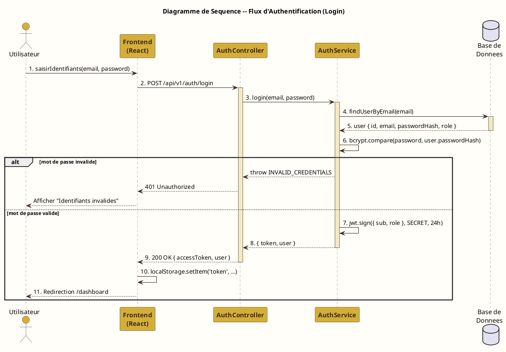
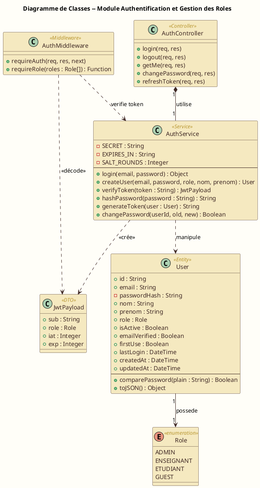

# Diagrammes UML — Module Authentification et Gestion des Rôles

Ce document contient la description complète **en texte** des deux
diagrammes UML du module : le **diagramme de séquence** (flux de
connexion) et le **diagramme de classes**.

Chaque diagramme est fourni sous deux formats :
- **Description textuelle détaillée** (pour comprendre / dessiner à la main)
- **Code PlantUML** (à coller sur https://www.plantuml.com/plantuml ou
  l'extension VS Code "PlantUML" pour générer l'image automatiquement)

---

# 1. DIAGRAMME DE SEQUENCE — Flux d'Authentification (Login)

## 1.1 Description textuelle

### Acteurs et objets impliqués (5 lifelines)

| # | Nom            | Type        | Rôle |
|---|----------------|-------------|------|
| 1 | Utilisateur    | Acteur      | Personne qui se connecte (admin, enseignant ou étudiant) |
| 2 | Frontend       | Composant   | Application React qui affiche la page de connexion |
| 3 | AuthController | Contrôleur  | Reçoit les requêtes HTTP côté backend Express |
| 4 | AuthService    | Service     | Encapsule la logique métier d'authentification |
| 5 | Base de Données| Système     | PostgreSQL accessible via l'ORM Prisma |

### Séquence des messages (chronologique)

**Étape 1 — Saisie des identifiants**
- Direction : `Utilisateur → Frontend`
- Message : `saisirIdentifiants(email, motDePasse)`
- Description : L'utilisateur ouvre la page `/login` et remplit le formulaire.

**Étape 2 — Envoi de la requête HTTP**
- Direction : `Frontend → AuthController`
- Message : `POST /api/v1/auth/login { email, password }`
- Description : Le frontend envoie une requête POST sécurisée (HTTPS).

**Étape 3 — Délégation au service**
- Direction : `AuthController → AuthService`
- Message : `login(email, password)`
- Description : Le contrôleur délègue la logique métier au service.

**Étape 4 — Recherche de l'utilisateur**
- Direction : `AuthService → Base de Données`
- Message : `findUserByEmail(email)`
- Description : Prisma exécute une requête SQL paramétrée.

**Étape 5 — Retour de l'utilisateur**
- Direction : `Base de Données → AuthService` (retour pointillé)
- Message : `user { id, email, passwordHash, role, isActive }`
- Description : L'objet User complet est retourné (ou null si introuvable).

**Étape 6 — Vérification du mot de passe (auto-message)**
- Direction : `AuthService → AuthService`
- Message : `bcrypt.compare(password, user.passwordHash)`
- Description : Comparaison cryptographique. Prend ~250 ms (cost factor 12).

**Alternative [si mot de passe invalide]**
- Direction : `AuthService → AuthController` (retour)
- Message : `throw Error('INVALID_CREDENTIALS')`
- Direction : `AuthController → Frontend` (retour)
- Message : `401 Unauthorized { error: 'INVALID_CREDENTIALS' }`
- Direction : `Frontend → Utilisateur` (retour)
- Message : `Afficher message "Email ou mot de passe invalide"`
- **FIN du flux alternatif**

**Étape 7 — Génération du token JWT (auto-message)**
- Direction : `AuthService → AuthService`
- Message : `jwt.sign({ sub: user.id, role: user.role }, SECRET, { expiresIn: '24h' })`
- Description : Le JWT est signé avec l'algorithme HMAC-SHA256.

**Étape 8 — Retour du token au contrôleur**
- Direction : `AuthService → AuthController` (retour pointillé)
- Message : `{ token, user }`

**Étape 9 — Réponse HTTP 200 au frontend**
- Direction : `AuthController → Frontend` (retour pointillé)
- Message : `200 OK { accessToken, refreshToken, user }`

**Étape 10 — Stockage du token (auto-message)**
- Direction : `Frontend → Frontend`
- Message : `localStorage.setItem('token', accessToken)`
- Description : Le token est stocké côté client pour les requêtes suivantes.

**Étape 11 — Redirection vers le tableau de bord**
- Direction : `Frontend → Utilisateur` (retour pointillé)
- Message : `Redirection vers /dashboard (selon le rôle)`
- Description : L'utilisateur voit son tableau de bord personnalisé.

---

## 1.2 Code PlantUML — Diagramme de Séquence



---

# 2. DIAGRAMME DE CLASSES — Module Authentification

## 2.1 Description textuelle

### Classes et énumérations

#### Classe : `User`
**Stéréotype :** `<<Entity>>` (modèle Prisma)

| Visibilité | Attribut          | Type      | Description                        |
|------------|-------------------|-----------|------------------------------------|
| +          | id                | String    | UUID, identifiant unique           |
| +          | email             | String    | Adresse email (unique, indexée)    |
| -          | passwordHash      | String    | Hash bcrypt du mot de passe        |
| +          | nom               | String    | Nom de famille                     |
| +          | prenom            | String    | Prénom                             |
| +          | role              | Role      | Référence à l'énumération Role     |
| +          | isActive          | Boolean   | Compte actif (true) ou désactivé   |
| +          | emailVerified     | Boolean   | Email vérifié                      |
| +          | firstUse          | Boolean   | Doit changer son mot de passe      |
| +          | lastLogin         | DateTime  | Date de dernière connexion         |
| +          | createdAt         | DateTime  | Date de création du compte         |
| +          | updatedAt         | DateTime  | Date de dernière modification      |

| Visibilité | Méthode                              | Retour    |
|------------|--------------------------------------|-----------|
| +          | comparePassword(plain : String)      | Boolean   |
| +          | toJSON()                             | Object    |

---

#### Énumération : `Role`
**Stéréotype :** `<<enumeration>>`

| Valeur     | Description                                    |
|------------|------------------------------------------------|
| ADMIN      | Administrateur — accès complet                 |
| ENSEIGNANT | Enseignant — gestion de ses cours et étudiants |
| ETUDIANT   | Étudiant — accès à ses propres données         |
| GUEST      | Invité — accès aux pages publiques uniquement  |

---

#### Classe : `AuthService`
**Stéréotype :** `<<Service>>`

| Visibilité | Attribut    | Type    | Description                       |
|------------|-------------|---------|-----------------------------------|
| -          | SECRET      | String  | Clé secrète JWT (variable env)    |
| -          | EXPIRES_IN  | String  | Durée de vie du token ('24h')     |
| -          | SALT_ROUNDS | Integer | Cost factor bcrypt (12)           |

| Visibilité | Méthode                                                  | Retour              |
|------------|----------------------------------------------------------|---------------------|
| +          | login(email : String, password : String)                 | { token, user }     |
| +          | createUser(email, password, role, nom, prenom)           | User                |
| +          | verifyToken(token : String)                              | JwtPayload          |
| +          | hashPassword(password : String)                          | String              |
| +          | generateToken(user : User)                               | String              |
| +          | changePassword(userId, oldPwd, newPwd)                   | Boolean             |

---

#### Classe : `AuthController`
**Stéréotype :** `<<Controller>>`

| Visibilité | Méthode                              | Retour                    |
|------------|--------------------------------------|---------------------------|
| +          | login(req, res)                      | HTTP 200 / 401            |
| +          | logout(req, res)                     | HTTP 200                  |
| +          | getMe(req, res)                      | HTTP 200 + User           |
| +          | changePassword(req, res)             | HTTP 200 / 400            |
| +          | refreshToken(req, res)               | HTTP 200 + nouveau token  |

---

#### Classe : `AuthMiddleware`
**Stéréotype :** `<<Middleware>>`

| Visibilité | Méthode                              | Retour                  |
|------------|--------------------------------------|-------------------------|
| +          | requireAuth(req, res, next)          | next() ou HTTP 401      |
| +          | requireRole(roles : Role[])          | Function (middleware)   |

---

#### Classe : `JwtPayload`
**Stéréotype :** `<<DTO>>`

| Visibilité | Attribut | Type    | Description                              |
|------------|----------|---------|------------------------------------------|
| +          | sub      | String  | Subject = identifiant utilisateur (UUID) |
| +          | role     | Role    | Rôle de l'utilisateur                    |
| +          | iat      | Integer | Issued At — timestamp d'émission         |
| +          | exp      | Integer | Expiration — timestamp d'expiration      |

---

### Relations entre les classes

| De                | Vers           | Type            | Cardinalité | Description                       |
|-------------------|----------------|-----------------|-------------|-----------------------------------|
| User              | Role           | Association     | 1 → 1       | Un utilisateur a un rôle          |
| AuthService       | User           | Dépendance      | utilise     | Recherche / crée des utilisateurs |
| AuthService       | JwtPayload     | Crée            | 1 → *       | Génère des payloads JWT           |
| AuthController    | AuthService    | Composition     | 1 → 1       | Le contrôleur utilise le service  |
| AuthMiddleware    | AuthService    | Dépendance      | utilise     | Vérifie le token via le service   |
| AuthMiddleware    | JwtPayload     | Crée            | 1 → *       | Décode et attache à req.user      |

---

## 2.2 Code PlantUML — Diagramme de Classes



---

# 3. COMMENT GÉNÉRER LES IMAGES

## Option 1 — En ligne (recommandé, le plus rapide)

1. Allez sur https://www.plantuml.com/plantuml/uml/
2. Copiez-collez le code PlantUML correspondant (entre `@startuml` et `@enduml`)
3. Cliquez sur "Submit" — l'image s'affiche
4. Téléchargez en PNG ou SVG via les boutons en bas

## Option 2 — VS Code (plus pratique pour itérer)

1. Installer l'extension **"PlantUML"** de jebbs (Marketplace VS Code)
2. Créer un fichier `sequence_login.puml` avec le code
3. `Alt + D` pour afficher l'aperçu
4. Clic droit → "Export Current Diagram" → PNG / SVG

## Option 3 — En ligne de commande (avec Java + plantuml.jar)

```bash
java -jar plantuml.jar sequence_login.puml
java -jar plantuml.jar class_diagram.puml
```

---

# 4. INTÉGRATION DANS LE RAPPORT LATEX

Une fois les images générées, placez-les dans `docs/rapport/images/`
puis ajoutez dans votre `.tex` :

```latex
\begin{figure}[H]
    \centering
    \includegraphics[width=0.95\textwidth]{sequence_login.png}
    \caption{Diagramme de séquence -- Flux d'authentification}
    \label{fig:seq-login}
\end{figure}

\begin{figure}[H]
    \centering
    \includegraphics[width=0.95\textwidth]{class_diagram.png}
    \caption{Diagramme de classes -- Module Authentification}
    \label{fig:class-auth}
\end{figure}
```
